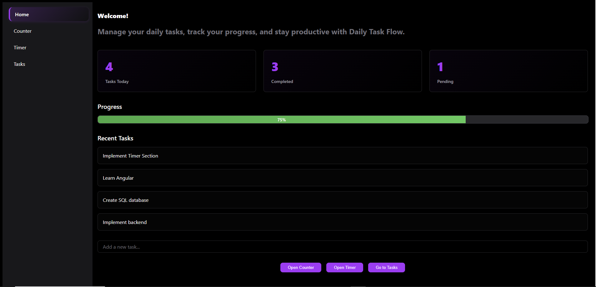
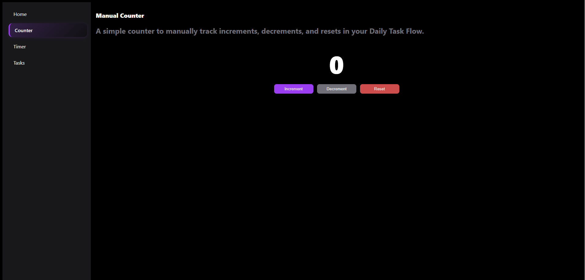
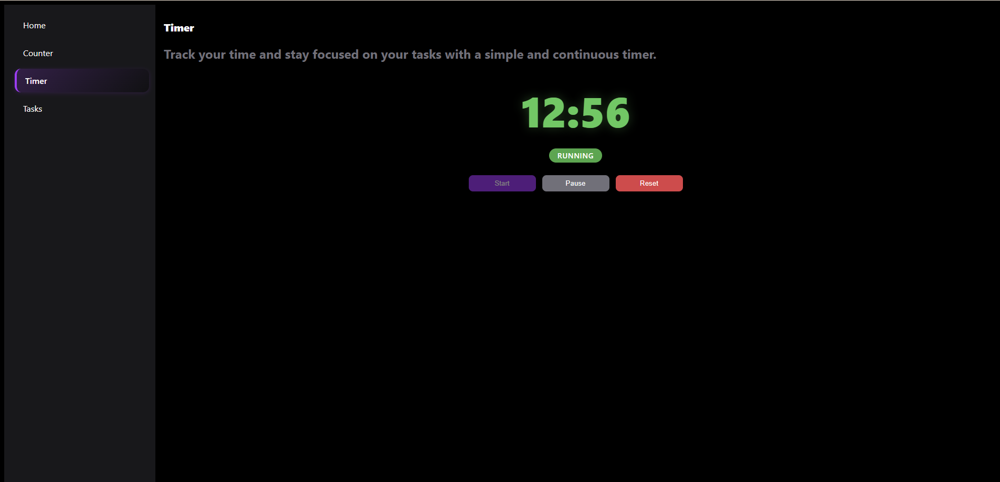
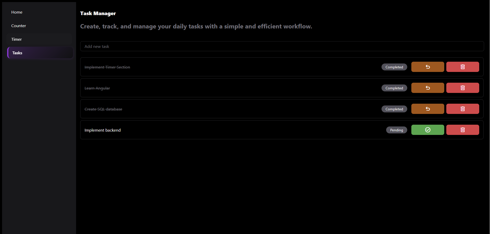

<h1 align="center">Daily Task Flow</h1>

<p align="center">
  <strong>Languages:</strong><br>
  <a href="README.pt.md">Portuguese</a> |
  <a href="README.md">English</a>
</p>

Daily Task Flow é uma **aplicação frontend de produtividade** construída com **Angular** para organizar pequenos fluxos diários de forma simples e visual. O app reúne um gerenciador de tarefas, um timer persistente, um contador manual e um dashboard inicial para ajudar o usuário a se manter organizado ao longo do dia.

A aplicação oferece:

- Dashboard com estatísticas diárias de tarefas e percentual de progresso
- Criação rápida de tarefas diretamente pela tela inicial
- Gerenciador de tarefas com ações de adicionar, concluir, desfazer e remover
- Timer persistente que continua contando após recarregar a página
- Contador manual para rastreamento incremental rápido
- Navegação lateral entre todas as seções do app
- Persistência local de dados com `localStorage`

## Motivação do Projeto

Este projeto foi criado para praticar os fundamentos do Angular por meio de uma ferramenta de produtividade mais realista do que componentes isolados de demonstração.

O principal objetivo foi construir uma aplicação single-page pequena, mas coesa, que demonstrasse:

- navegação com Angular Router
- gerenciamento de estado com Angular Signals
- componentes compartilhados reutilizáveis
- persistência local para melhorar a experiência do usuário
- composição limpa de interface entre múltiplas telas

## Funcionalidades Atuais

### Frontend (Angular)

- Tela inicial com:
  - seção de boas-vindas e visão geral do app
  - cards de resumo de tarefas totais, concluídas e pendentes
  - barra de progresso baseada no percentual de tarefas concluídas
  - prévia das tarefas recentes
  - input de adição rápida de tarefas
  - botões de atalho para as principais ferramentas
- Tela de tarefas com:
  - criação de tarefas via tecla enter
  - alternância de conclusão da tarefa
  - ação de desfazer para tarefas concluídas
  - remoção de tarefas
  - badges visuais para status `Completed` e `Pending`
- Tela de timer com:
  - controles de iniciar, pausar e resetar
  - indicador de status em execução/pausado
  - persistência do tempo decorrido com `localStorage`
  - recuperação automática do timer após refresh da página, quando estiver em execução
- Tela de contador com:
  - ação de incremento
  - ação de decremento
  - ação de reset
- Estrutura compartilhada de UI:
  - layout reutilizável com sidebar e router outlet
  - componente de título reutilizável para headings de telas
  - componentes reutilizáveis de menu e item de menu
  - destaque da rota ativa na navegação lateral

### Dados e Estado

- `TasksService` armazena tarefas com Angular Signals
- persistência automática das tarefas em `localStorage`
- tarefas iniciais padrão quando não existe conteúdo salvo
- métricas computadas para total, concluídas e pendentes
- `TimerService` armazena o estado do timer em `localStorage`
- saída formatada do timer em `MM:SS`

## Fluxo da Aplicação

1. Abrir a tela inicial
2. Revisar o resumo atual de tarefas e o progresso
3. Adicionar uma tarefa rápida ou abrir a tela completa de tarefas
4. Gerenciar tarefas marcando como concluídas, desfazendo ou removendo
5. Usar a tela de timer para acompanhar tempo de foco
6. Usar a tela de contador para contagem manual quando necessário

## Tecnologias

### Frontend

- Angular 21
- TypeScript
- Angular Router
- Angular Signals
- Angular Material Icons
- RxJS
- SCSS

## Como Rodar Localmente

### 1. Clone o repositório

```bash
git clone https://github.com/pitercoding/daily-task-flow.git
cd daily-task-flow
```

### 2. Instale as dependências

```bash
cd frontend
npm install
```

### 3. Inicie o servidor de desenvolvimento

```bash
npm start
```

### 4. Abra a aplicação

- Frontend: `http://localhost:4200`

## Scripts Disponíveis

Dentro de `frontend/`, os principais scripts são:

```bash
npm start
npm run build
npm test
```

## Observações sobre Persistência de Dados

- As tarefas são armazenadas em `localStorage` na chave `tasks`
- O estado inicial do timer é armazenado em `localStorage`
- Se o timer estiver rodando e a página for recarregada, o app restaura o tempo decorrido
- Quando ainda não existe lista salva, o app inicializa um pequeno conjunto padrão de tarefas

## Status dos Testes

Status atual:

- o projeto gera build com sucesso usando `npm run build`
- ainda não existem arquivos customizados `*.spec.ts`
- o script de testes gerado pelo Angular está disponível, mas os testes automatizados específicos do projeto ainda não foram implementados

Próximo escopo recomendado para testes:

- testes de componentes para `Home`, `Tasks`, `Timer` e `Counter`
- testes de serviços para `TasksService` e `TimerService`
- testes de renderização de rotas para a navegação lateral
- testes de persistência com `localStorage` para tarefas e recuperação do timer

## Próximas Melhorias

### Produto e UX

- Adicionar edição de tarefas
- Adicionar categorias ou prioridades de tarefa
- Adicionar datas limite e opções de filtro
- Adicionar histórico diário ou visualização de tarefas arquivadas
- Melhorar o comportamento responsivo em telas menores

### Engenharia

- Adicionar testes unitários para componentes e serviços
- Adicionar route guards ou futura personalização por perfil caso autenticação seja introduzida
- Melhorar acessibilidade e fluxo de teclado
- Introduzir uma abstração mais limpa de persistência em vez de acesso direto ao `localStorage` nos serviços

### Expansão Futura

- Adicionar integração com backend para sincronização em nuvem
- Adicionar autenticação e contas de usuário
- Adicionar métricas como tempo focado por dia
- Adicionar modos de timer como Pomodoro ou sessões focadas

## Estrutura de Pastas

```text
daily-task-flow/
|-- frontend/                                # Aplicação Angular
|   |-- public/
|   |   `-- screenshots/                    # Screenshots do projeto usados no README
|   |-- src/
|   |   |-- app/
|   |   |   |-- components/shared/          # Componentes reutilizáveis de layout, menu e título
|   |   |   |-- models/                     # Modelos da aplicação
|   |   |   |-- screens/                    # Telas principais do app
|   |   |   |   |-- home/
|   |   |   |   |-- counter/
|   |   |   |   |-- timer/
|   |   |   |   `-- tasks/
|   |   |   |-- services/                   # Gerenciamento de estado de tarefas e timer
|   |   |   |-- app.routes.ts               # Rotas da aplicação
|   |   |   |-- app.ts                      # Componente raiz
|   |   |   `-- app.html                    # Template raiz
|   |   |-- main.ts                         # Bootstrap do Angular
|   |   `-- styles.scss                     # Estilos globais
|   |-- angular.json
|   |-- package.json
|   `-- package-lock.json
|-- README.md                                # Documentação (English)
`-- README.pt.md                             # Documentação (Portuguese)
```

## Screenshots & Visuais

### Dashboard Inicial



### Contador Manual



### Tela de Timer



### Gerenciador de Tarefas



## Licença

Este projeto está licenciado sob a **MIT License**.

## Author

**Piter Gomes** - Computer Science Student (6th Semester) & Full-Stack Developer

[Email](mailto:piterg.bio@gmail.com) | [LinkedIn](https://www.linkedin.com/in/piter-gomes-4a39281a1/) | [GitHub](https://github.com/pitercoding) | [Portfolio](https://portfolio-pitergomes.vercel.app/)
